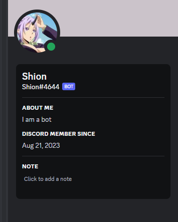
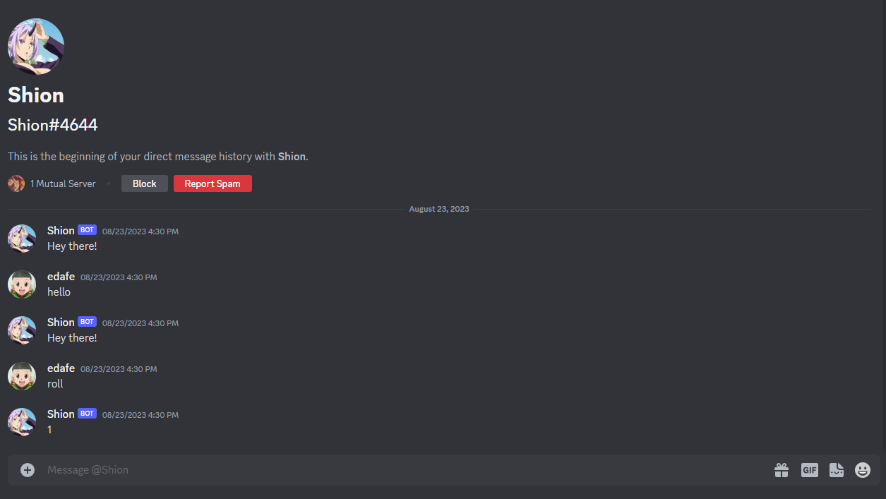

# Incomplete Discord Chat Bot README

## Table of Contents

- [Incomplete Discord Chat Bot](#incomplete-discord-chat-bot)
  - [Introduction](#introduction)
  - [Features](#features)
  - [Usage](#Usage)
  - [Visuals](#visuals)
  - [Prerequisites](#prerequisites)


## Introduction
The Incomplete Discord Chat Bot is a work-in-progress project designed to respond to specific prompts in a Discord server. While currently incomplete, the bot is intended to have the ability to send messages to a designated channel based on specific triggers.

## Features (Planned)
**Prompt Responses**: The bot is designed to respond to three predetermined prompts with different messages.
**Channel Interaction**: It should be able to send messages to a specified channel within the Discord server (not working as intended).

## Usage (Current State)
As of now, the Discord chatbot is in an incomplete state. Key feature, specific channel interaction via server ID, is not functional.

## Visuals



## Prerequisites
Make sure you have the following prerequisites installed:

Python (version 3.10 or above)
Required Python packages (see requirements.txt file)

Also check out the discord developer portal https://discord.com/developers/docs/intro 
Run install: 
```bash
pip install discord
```
